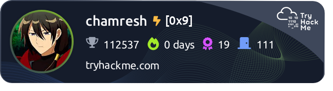

## Hi there 👋

<!-- THM-START -->
<!-- The TryHackMe live badge and info will be auto-updated by GitHub Actions. Do NOT edit between these markers. -->

Last updated: 2025-10-27 01:00 UTC

<!-- THM-END -->

<!-- Optional: other content below -->

<!--

**chamresh/chamresh** is a ✨ _special_ ✨ repository because its `README.md` (this file) appears on your GitHub profile.

Here are some ideas to get you started:

- 🔭 I’m currently working on ...
- 🌱 I’m currently learning ...
- 👯 I’m looking to collaborate on ...
- 🤔 I’m looking for help with ...
- 💬 Ask me about ...
- 📫 How to reach me: ...
- 😄 Pronouns: ...
- ⚡ Fun fact: ...
-->
